# ETL GUI Threading Architecture

This diagram focuses specifically on the GUI threading layer of the ETL system, showing how PySide6 QThread manages user interface responsiveness and background operations.

```mermaid
---
title: ETL GUI Threading Architecture
config:
  flowchart:
    htmlLabels: false
    curve: cardinal
---
flowchart TB
    %% User Interface Layer
    subgraph UserInterface ["🖥️ User Interface Layer"]
        direction TB
        MainWindow["🏠 ETL Main Window<br/>PySide6.QtWidgets.QMainWindow<br/>Always Responsive"]
        MainWindow:::mainWindow
        
        subgraph UIControls ["🎛️ UI Controls"]
            direction LR
            APIButton["⚡ Load API Data Button<br/>QPushButton"]
            CSVButton["📊 Load CSV Button<br/>QPushButton"] 
            DBButton["🗄️ Create Tables Button<br/>QPushButton"]
            TestButton["🔍 Test Connection Button<br/>QPushButton"]
            
            APIButton:::uiButton
            CSVButton:::uiButton
            DBButton:::uiButton
            TestButton:::uiButton
        end
        
        subgraph UIFeedback ["📱 UI Feedback Components"]
            direction LR
            StatusBar["📊 Status Bar<br/>QStatusBar"]
            ProgressArea["📈 Progress Display<br/>QTextEdit"]
            ErrorDialog["❌ Error Messages<br/>QMessageBox"]
            
            StatusBar:::feedback
            ProgressArea:::feedback
            ErrorDialog:::feedback
        end
        
        MainWindow --> UIControls
        MainWindow --> UIFeedback
    end
    
    %% Main GUI Thread
    subgraph MainGUIThread ["🧵 Main GUI Thread (Always Responsive)"]
        direction TB
        EventLoop["🔄 Qt Event Loop<br/>processEvents()<br/>Never Blocks"]
        EventLoop:::eventLoop
        
        ClickHandler["👆 Click Event Handlers<br/>Slot Functions<br/>Immediate Response"]
        ClickHandler:::clickHandler
        
        EventLoop --> ClickHandler
    end
    
    %% User Actions Flow
    APIButton -->|"User Click"| ClickHandler
    CSVButton -->|"User Click"| ClickHandler
    DBButton -->|"User Click"| ClickHandler
    TestButton -->|"User Click"| ClickHandler
    
    %% Worker Thread Factory
    subgraph WorkerFactory ["🏭 Worker Thread Factory"]
        direction TB
        ThreadCreator["⚙️ ETLWorker Creator<br/>QThread Instantiation<br/>Operation Routing"]
        ThreadCreator:::factory
        
        WorkerConfig["⚙️ Worker Configuration<br/>• Operation Type<br/>• Parameters<br/>• Callbacks"]
        WorkerConfig:::config
        
        ThreadCreator --> WorkerConfig
    end
    
    ClickHandler --> ThreadCreator
    
    %% Individual Worker Threads
    subgraph WorkerThreads ["🎯 Background Worker Threads"]
        direction TB
        
        subgraph APIWorkerThread ["⚡ API Worker Thread"]
            direction TB
            APIWorker["🚀 ETLWorker('load_api')<br/>QThread Subclass<br/>Non-blocking Execution"]
            APIWorker:::workerThread
            
            APIOperation["📡 API Operations<br/>• Fetch from endpoints<br/>• Data processing<br/>• Save to CSV"]
            APIOperation:::operation
            
            APIWorker --> APIOperation
        end
        
        subgraph CSVWorkerThread ["📊 CSV Worker Thread"]
            direction TB
            CSVWorker["📋 ETLWorker('load_csv')<br/>QThread Subclass<br/>File Processing"]
            CSVWorker:::workerThread
            
            CSVOperation["📄 CSV Operations<br/>• File reading<br/>• Data validation<br/>• Database insert"]
            CSVOperation:::operation
            
            CSVWorker --> CSVOperation
        end
        
        subgraph DBWorkerThread ["🗄️ Database Worker Thread"]
            direction TB
            DBWorker["🔧 ETLWorker('create_tables')<br/>QThread Subclass<br/>Schema Management"]
            DBWorker:::workerThread
            
            DBOperation["🏗️ Database Operations<br/>• Table creation<br/>• Schema validation<br/>• Connection testing"]
            DBOperation:::operation
            
            DBWorker --> DBOperation
        end
        
        subgraph TestWorkerThread ["🔍 Test Worker Thread"]
            direction TB
            TestWorker["🔬 ETLWorker('test_connection')<br/>QThread Subclass<br/>Connectivity Check"]
            TestWorker:::workerThread
            
            TestOperation["🔌 Test Operations<br/>• DB connectivity<br/>• API availability<br/>• Health checks"]
            TestOperation:::operation
            
            TestWorker --> TestOperation
        end
    end
    
    ThreadCreator --> APIWorker
    ThreadCreator --> CSVWorker
    ThreadCreator --> DBWorker
    ThreadCreator --> TestWorker
    
    %% Signal System
    subgraph SignalSystem ["📡 Qt Signal-Slot System (Thread-Safe Communication)"]
        direction TB
        
        subgraph SignalTypes ["📊 Signal Types"]
            direction LR
            ProgressSignal["📈 progress.emit(str)<br/>Real-time Updates"]
            ErrorSignal["❌ error.emit(str)<br/>Error Notifications"]
            FinishedSignal["✅ finished.emit(str)<br/>Completion Status"]
            DataSignal["📦 data_ready.emit(dict)<br/>Result Delivery"]
            
            ProgressSignal:::signal
            ErrorSignal:::signal
            FinishedSignal:::signal
            DataSignal:::signal
        end
        
        subgraph SignalHandlers ["🎯 Signal Handlers (Main Thread)"]
            direction LR
            UpdateProgress["📊 Update Progress Display<br/>Non-blocking UI Update"]
            ShowError["❌ Show Error Dialog<br/>User Notification"]
            HandleCompletion["✅ Operation Complete<br/>UI State Reset"]
            ProcessData["📦 Process Results<br/>Display Data"]
            
            UpdateProgress:::handler
            ShowError:::handler
            HandleCompletion:::handler
            ProcessData:::handler
        end
        
        SignalTypes --> SignalHandlers
    end
    
    %% Signal Emissions from Workers
    APIOperation --> ProgressSignal
    CSVOperation --> ProgressSignal
    DBOperation --> ProgressSignal
    TestOperation --> ProgressSignal
    
    APIOperation --> ErrorSignal
    CSVOperation --> ErrorSignal
    DBOperation --> ErrorSignal
    TestOperation --> ErrorSignal
    
    APIOperation --> FinishedSignal
    CSVOperation --> FinishedSignal
    DBOperation --> FinishedSignal
    TestOperation --> FinishedSignal
    
    APIOperation --> DataSignal
    
    %% Signal Reception in Main Thread
    UpdateProgress --> ProgressArea
    ShowError --> ErrorDialog
    HandleCompletion --> StatusBar
    ProcessData --> ProgressArea
    
    %% Thread Lifecycle Management
    subgraph ThreadLifecycle ["♻️ Thread Lifecycle Management"]
        direction TB
        ThreadStart["🚀 worker.start()<br/>Begin Background Execution"]
        ThreadMonitor["👁️ Thread Monitoring<br/>State Tracking"]
        ThreadCleanup["🧹 Thread Cleanup<br/>Resource Management"]
        
        ThreadStart:::lifecycle
        ThreadMonitor:::lifecycle
        ThreadCleanup:::lifecycle
        
        ThreadStart --> ThreadMonitor
        ThreadMonitor --> ThreadCleanup
    end
    
    ThreadCreator --> ThreadStart
    HandleCompletion --> ThreadCleanup
    
    %% Thread Safety Features
    subgraph ThreadSafety ["🔒 Thread Safety Features"]
        direction TB
        QtSignals["📡 Qt Signals<br/>Thread-safe Communication<br/>Automatic Queuing"]
        ThreadLocal["🏠 Thread-local Storage<br/>Isolated Worker Data<br/>No Shared State"]
        
        QtSignals:::safety
        ThreadLocal:::safety
    end
    
    SignalSystem --> QtSignals
    WorkerThreads --> ThreadLocal
    
    %% Performance Benefits
    subgraph Performance ["📊 Performance Benefits"]
        direction LR
        UIResponsive["🖥️ UI Always Responsive<br/>Never Freezes<br/>Smooth Interactions"]
        ParallelOps["⚡ Parallel Operations<br/>Multiple Workers<br/>Concurrent Processing"]
        UserExp["👤 Better UX<br/>Real-time Feedback<br/>Cancellation Support"]
        
        UIResponsive:::benefit
        ParallelOps:::benefit
        UserExp:::benefit
    end
    
    MainGUIThread --> UIResponsive
    WorkerThreads --> ParallelOps
    SignalSystem --> UserExp
    
    %% Class Definitions
    classDef mainWindow fill:#e3f2fd,stroke:#1976d2,stroke-width:3px,color:#000
    classDef uiButton fill:#f3e5f5,stroke:#7b1fa2,stroke-width:2px,color:#000
    classDef feedback fill:#fff3e0,stroke:#f57c00,stroke-width:2px,color:#000
    classDef eventLoop fill:#e8f5e8,stroke:#388e3c,stroke-width:3px,color:#000
    classDef clickHandler fill:#e1f5fe,stroke:#0277bd,stroke-width:2px,color:#000
    classDef factory fill:#fce4ec,stroke:#c2185b,stroke-width:2px,color:#000
    classDef config fill:#f1f8e9,stroke:#689f38,stroke-width:2px,color:#000
    classDef workerThread fill:#e0f2f1,stroke:#00695c,stroke-width:2px,color:#000
    classDef operation fill:#e8eaf6,stroke:#3f51b5,stroke-width:2px,color:#000
    classDef signal fill:#fff8e1,stroke:#ffa000,stroke-width:2px,color:#000
    classDef handler fill:#f9fbe7,stroke:#827717,stroke-width:2px,color:#000
    classDef lifecycle fill:#fce4ec,stroke:#ad1457,stroke-width:2px,color:#000
    classDef safety fill:#ffebee,stroke:#d32f2f,stroke-width:2px,color:#000
    classDef benefit fill:#e8f5e8,stroke:#2e7d32,stroke-width:2px,color:#000
```

## GUI Threading Sequence Flow

```mermaid
---
title: GUI Thread Communication Sequence
---
sequenceDiagram
    participant User as 👤 User
    participant Button as 🎛️ UI Button
    participant MainThread as 🧵 Main Thread
    participant Factory as 🏭 Thread Factory
    participant Worker as 🎯 Worker Thread
    participant UI as 🖥️ UI Components
    
    User->>Button: Click Load API Data
    Button->>MainThread: Emit clicked() signal
    MainThread->>Factory: Create ETLWorker("load_api")
    Factory->>Worker: Instantiate QThread
    MainThread->>Worker: worker.start()
    
    Note over Worker: Background Execution Begins
    Note over MainThread: Main Thread Remains Free
    
    Worker->>UI: progress.emit("Connecting to API...")
    UI->>User: Update progress display
    
    Worker->>UI: progress.emit("Fetching data...")
    UI->>User: Update progress display
    
    Worker->>UI: progress.emit("Processing results...")
    UI->>User: Update progress display
    
    Worker->>UI: data_ready.emit(dataframes)
    UI->>User: Display results
    
    Worker->>UI: finished.emit("Success")
    UI->>User: Show completion status
    
    MainThread->>Worker: Cleanup thread resources
```

## Thread State Management

| **Thread State** | **Main GUI** | **Worker Threads** | **UI Responsiveness** |
|------------------|--------------|-------------------|---------------------|
| **🏠 Idle** | Event Processing | None Active | 100% Responsive |
| **🚀 Working** | Event Processing | 1-4 Active | 100% Responsive |
| **📊 Updating** | Signal Handling | Background Execution | 100% Responsive |
| **❌ Error** | Error Display | Thread Cleanup | 100% Responsive |

## Key GUI Threading Benefits

🔥 **Never Blocking**: Main thread always processes UI events  
⚡ **Parallel Processing**: Multiple operations can run simultaneously  
📡 **Real-time Feedback**: Progress updates without UI freezing  
🛡️ **Error Isolation**: Worker thread errors don't crash GUI  
♻️ **Resource Management**: Automatic thread cleanup and resource management  
🎯 **Type Safety**: Qt's signal-slot system ensures thread-safe communication