# ETL Multi-Threading Architecture Diagram

This diagram shows the comprehensive multi-threading architecture of the ETL system, illustrating how different threading layers work together to provide optimal performance and user experience.

```mermaid
---
title: ETL Multi-Threading Architecture
config:
  flowchart:
    htmlLabels: false
    curve: cardinal
---
flowchart TB
    %% Main GUI Thread
    MainGUI["🖥️ Main GUI Thread<br/>PySide6 Event Loop<br/>Always Responsive"]
    MainGUI:::mainThread
    
    %% User Actions
    UserLoad["👤 User Clicks Load API Data"]
    UserCSV["👤 User Clicks Load CSV"]
    UserDB["👤 User Clicks Create Tables"]
    
    UserLoad --> MainGUI
    UserCSV --> MainGUI  
    UserDB --> MainGUI
    
    %% Worker Thread Management
    MainGUI --> WorkerFactory["🏭 Worker Thread Factory<br/>ETLWorker Creation"]
    WorkerFactory:::factory
    
    %% Individual Worker Threads
    subgraph WorkerPool ["🎯 Worker Thread Pool"]
        direction TB
        APIWorker["⚡ API Worker Thread<br/>QThread: load_api<br/>Non-blocking Operation"]
        CSVWorker["📊 CSV Worker Thread<br/>QThread: load_csv<br/>File Processing"]  
        DBWorker["🗄️ DB Worker Thread<br/>QThread: create_tables<br/>Schema Management"]
        
        APIWorker:::workerThread
        CSVWorker:::workerThread
        DBWorker:::workerThread
    end
    
    WorkerFactory --> APIWorker
    WorkerFactory --> CSVWorker
    WorkerFactory --> DBWorker
    
    %% Signal Communication
    subgraph SignalLayer ["📡 Signal Communication Layer"]
        direction LR
        ProgressSignal["📊 progress.emit()"]
        ErrorSignal["❌ error.emit()"] 
        FinishedSignal["✅ finished.emit()"]
        DataSignal["📦 data_ready.emit()"]
        
        ProgressSignal:::signal
        ErrorSignal:::signal
        FinishedSignal:::signal
        DataSignal:::signal
    end
    
    APIWorker --> ProgressSignal
    CSVWorker --> ProgressSignal
    DBWorker --> ProgressSignal
    
    APIWorker --> ErrorSignal
    CSVWorker --> ErrorSignal
    DBWorker --> ErrorSignal
    
    APIWorker --> FinishedSignal
    CSVWorker --> FinishedSignal
    DBWorker --> FinishedSignal
    
    APIWorker --> DataSignal
    
    %% Signal Reception
    ProgressSignal --> MainGUI
    ErrorSignal --> MainGUI
    FinishedSignal --> MainGUI
    DataSignal --> MainGUI
    
    %% Database Connection Pool Layer
    subgraph DBPool ["🔗 Database Connection Pool Layer"]
        direction TB
        PoolManager["🏊 Connection Pool Manager<br/>Thread-Safe Singleton<br/>5 Concurrent Connections"]
        PoolManager:::dbPool
        
        subgraph Connections ["Database Connections"]
            direction LR
            Conn1["🔌 Connection 1<br/>Thread ID: 12345"]
            Conn2["🔌 Connection 2<br/>Thread ID: 12346"] 
            Conn3["🔌 Connection 3<br/>Thread ID: 12347"]
            Conn4["🔌 Connection 4<br/>Available"]
            Conn5["🔌 Connection 5<br/>Available"]
            
            Conn1:::activeConn
            Conn2:::activeConn
            Conn3:::activeConn
            Conn4:::idleConn
            Conn5:::idleConn
        end
        
        PoolManager --> Connections
        
        PoolLock["🔒 threading.Lock()<br/>Thread Synchronization"]
        PoolLock:::lock
        PoolManager --> PoolLock
    end
    
    %% Workers access DB Pool
    APIWorker --> PoolManager
    CSVWorker --> PoolManager
    DBWorker --> PoolManager
    
    %% Logging Thread Layer
    subgraph LoggingLayer ["📝 Thread-Aware Logging System"]
        direction TB
        LogManager["📋 Log Manager<br/>Thread-Local Storage"]
        LogManager:::logSystem
        
        ThreadLocal["🧵 threading.local()<br/>Per-Thread Correlation IDs"]
        ThreadLocal:::threadLocal
        
        LogManager --> ThreadLocal
        
        subgraph LogDestinations ["Log Destinations"]
            direction LR
            Console["🖥️ Console Output"]
            FileLog["📄 File Logging"]
            StructLog["📊 Structured JSON"]
            
            Console:::logOutput
            FileLog:::logOutput
            StructLog:::logOutput
        end
        
        LogManager --> LogDestinations
        
        ThreadId["🏷️ Thread ID Tracking<br/>threading.get_ident()"]
        ThreadId:::threadId
        LogManager --> ThreadId
    end
    
    %% All workers log
    APIWorker --> LogManager
    CSVWorker --> LogManager
    DBWorker --> LogManager
    
    %% Async Concurrency Layer
    subgraph AsyncLayer ["⚡ Async Concurrency Layer"]
        direction TB
        AsyncClient["🚀 AsyncAPIClient<br/>aiohttp Session Pool<br/>Connection Reuse"]
        AsyncClient:::asyncClient
        
        Semaphore["🚦 asyncio.Semaphore(10)<br/>Concurrent Request Limiter"]
        Semaphore:::semaphore
        
        AsyncClient --> Semaphore
        
        subgraph ConcurrentOps ["Concurrent Operations"]
            direction LR
            Req1["📡 HTTP Request 1<br/>GET /orders"]
            Req2["📡 HTTP Request 2<br/>GET /customers"] 
            Req3["📡 HTTP Request 3<br/>GET /order_items"]
            Req4["📡 HTTP Request 4-10<br/>Additional Endpoints"]
            
            Req1:::asyncReq
            Req2:::asyncReq
            Req3:::asyncReq
            Req4:::asyncReq
        end
        
        AsyncClient --> ConcurrentOps
        
        BatchProcessor["⚙️ Batch Processor<br/>asyncio.gather()<br/>Concurrent Execution"]
        BatchProcessor:::batchProc
        
        ConcurrentOps --> BatchProcessor
    end
    
    %% API Worker uses Async Layer
    APIWorker --> AsyncClient
    
    %% Fallback Sync Layer
    subgraph SyncLayer ["🛡️ Sync Fallback Layer"]
        direction TB
        SyncClient["🔄 Sync HTTP Client<br/>requests.Session<br/>Sequential Processing"]
        SyncClient:::syncClient
        
        SyncFallback["🎯 Smart Fallback Logic<br/>ASYNC_AVAILABLE Flag<br/>Graceful Degradation"]
        SyncFallback:::fallback
        
        AsyncClient -.->|"Import Error"| SyncFallback
        SyncFallback --> SyncClient
    end
    
    %% Performance Monitoring
    subgraph PerfLayer ["📊 Performance Monitoring"]
        direction LR
        Stats["📈 Threading Statistics<br/>• Active Connections<br/>• Request Counts<br/>• Thread Performance"]
        Stats:::perfStats
        
        Timing["⏱️ Operation Timing<br/>• Async vs Sync Speed<br/>• Thread Overhead<br/>• Response Times"]  
        Timing:::timing
        
        Stats --> Timing
    end
    
    %% All layers report to performance monitoring
    AsyncLayer --> Stats
    SyncLayer --> Stats
    DBPool --> Stats
    WorkerPool --> Stats
    
    %% Class Definitions
    classDef mainThread fill:#e1f5fe,stroke:#01579b,stroke-width:3px,color:#000
    classDef factory fill:#f3e5f5,stroke:#4a148c,stroke-width:2px,color:#000
    classDef workerThread fill:#e8f5e8,stroke:#1b5e20,stroke-width:2px,color:#000
    classDef signal fill:#fff3e0,stroke:#e65100,stroke-width:2px,color:#000
    classDef dbPool fill:#e0f2f1,stroke:#00695c,stroke-width:2px,color:#000
    classDef activeConn fill:#c8e6c9,stroke:#2e7d32,stroke-width:2px,color:#000
    classDef idleConn fill:#f1f8e9,stroke:#689f38,stroke-width:1px,color:#000
    classDef lock fill:#ffebee,stroke:#c62828,stroke-width:2px,color:#000
    classDef logSystem fill:#f9fbe7,stroke:#827717,stroke-width:2px,color:#000
    classDef threadLocal fill:#fff8e1,stroke:#f57f17,stroke-width:2px,color:#000
    classDef logOutput fill:#fce4ec,stroke:#ad1457,stroke-width:1px,color:#000
    classDef threadId fill:#e8eaf6,stroke:#303f9f,stroke-width:1px,color:#000
    classDef asyncClient fill:#e3f2fd,stroke:#0277bd,stroke-width:3px,color:#000
    classDef semaphore fill:#e1f5fe,stroke:#0288d1,stroke-width:2px,color:#000
    classDef asyncReq fill:#b3e5fc,stroke:#0277bd,stroke-width:1px,color:#000
    classDef batchProc fill:#81d4fa,stroke:#0277bd,stroke-width:2px,color:#000
    classDef syncClient fill:#fafafa,stroke:#424242,stroke-width:2px,color:#000
    classDef fallback fill:#fff9c4,stroke:#f57f17,stroke-width:2px,color:#000
    classDef perfStats fill:#f1f8e9,stroke:#558b2f,stroke-width:2px,color:#000
    classDef timing fill:#e8f5e8,stroke:#388e3c,stroke-width:2px,color:#000
```

## Threading Flow Sequence

## Performance Characteristics

| **Threading Layer** | **Concurrency** | **Performance Gain** | **Use Case** |
|-------------------|-----------------|-------------------|-------------|
| 🖥️ **GUI Threading** | 1 main + N workers | UI Never Blocks | User Experience |
| 🎯 **Worker Threads** | 1 per operation | Parallel ETL Ops | Task Isolation |
| 🏊 **DB Connection Pool** | 5 concurrent | ~5x DB Throughput | Resource Sharing |
| ⚡ **Async API Layer** | 10 concurrent | ~10x API Speed | Network I/O |
| 🛡️ **Sync Fallback** | Sequential | 100% Reliability | Error Recovery |
